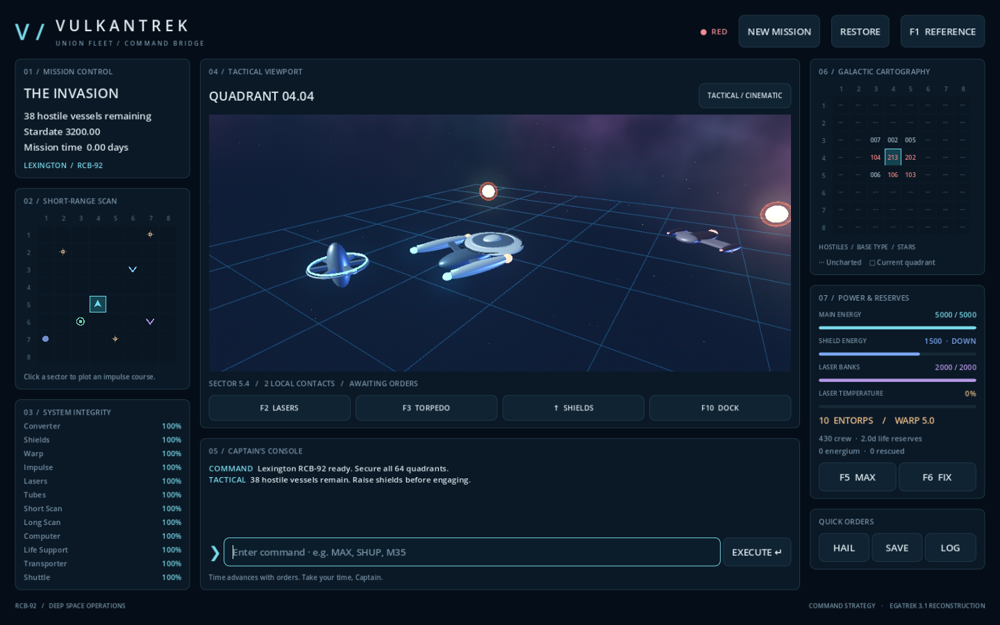

# VulkanTrek

A playable Godot 4 reconstruction of Trek’s command bridge, with Vulkan Forward+, procedural 3D ships, a nebula sky, glowing engines, shield fields, weapon effects, and a modern console.

**Status: playable reconstruction, not yet an exact Trek replacement.** The familiar command loop is implemented. Combat constants, mission generation, timing, scoring, and uncommon encounters still need comparison against the DOS executable. See [the parity register](docs/PARITY.md) and [implementation plan](docs/PLAN.md).



## Run

Open `project.godot` in Godot 4.5 or newer and press F5, or run:

```bash
./tools/run.sh
```

The launcher finds an installed Godot, the bundled development runtime in
`build/`, or an explicit `GODOT_BIN=/path/to/Godot`. Forward+ uses Vulkan by
default. For older GPUs:

```bash
./tools/run.sh --rendering-method gl_compatibility --rendering-driver opengl3
```

The standalone local development package is in `build/`; launch `build/play.sh`.
It includes a runtime and game pack. Production exports still require matching
release templates and platform testing.

## First encounter

Captain difficulty, seed `1994`: **24 hostiles, 36 mission days**. Start at
quadrant 4,4, sector 5,4 with a dependable StarBase and two hostiles nearby.

```text
SHUP
LASERS 900 650
M53
DOCK
WARP 4
```

The opening salvo clears the quadrant. Docking takes 0.3 days and refills your
main power, shields, crew and torpedoes. Lasers use **main energy**, with at most
2000 per salvo; there is no separate laser bank to refill. `MAX` transfers main
power into depleted shields. `INFO` gives target roles and laser solutions.

Use the live fleet counts on the galaxy chart or `REPORT` to find every remaining
hostile. Click a quadrant to prepare a warp course with an empty arrival sector.
Local movement routes around obstacles. `HAIL` locates the nearest StarBase.
A gold border marks a relief objective; clearing it in time earns 500 score.

**Read the cost preview, then Enter executes.** Clicking maps, typing, opening
reports and watching animations never advance time. Movement and weapons let
surviving local enemies respond; waiting repairs allow one response per 0.1 day.
Watch heat and damaged life support before attempting a long journey.

Coordinates are **row, column**, starting at 1. `M35` moves to local sector 3,5;
`M6235` travels to quadrant 6,2 sector 3,5. F1 opens the command reference.
F2–F10 prepare familiar commands; arrows prepare shield orders. Ctrl+arrows browse
history; Escape cancels entry. `SELF CONFIRM` destroys your ship; use `SAVE` to save.

## Saves

Saves use Godot's `user://mission.save`, separate from the repository. Version 2
preserves the deadline, relief state, enemy abilities and RNG continuation.
Version-1 saves migrate their old laser reserve into main power, capped at 5000,
and receive a fresh 36-day window. The restore log explains the migration.

## Validate

```bash
./tools/run.sh --headless --editor --quit
./tools/run.sh --headless --script res://tests/test_simulation.gd
./tools/run.sh --headless --script res://tests/test_campaign.gd
./tools/run.sh --headless --script res://tests/test_bridge.gd
./tools/run.sh --headless --script res://tests/test_playthrough.gd
./tools/run.sh --headless -- --smoke-test
```

The playthrough pilot issues normal commands on five Captain seeds and writes
transcripts to `/tmp/vulkantrek-pilot-*.json`. These establish feasibility, not
human enjoyment or balance across every seed and difficulty.

To capture the live Vulkan bridge:

```bash
./tools/run.sh --rendering-method forward_plus --rendering-driver vulkan -- --capture
```

## Project structure

Trek is Nels Anderson’s game. This project contains new code and procedural artwork, with no original executable, text, or graphics redistributed. The gameplay reference is particularly `TREK.DOC` and `TREK.REF` from its [original shareware archive](https://www.dosgamesarchive.com/file/trek/trk31). Godot’s [renderer documentation](https://docs.godotengine.org/en/stable/tutorials/rendering/renderers.html) describes Forward+ and Vulkan.
